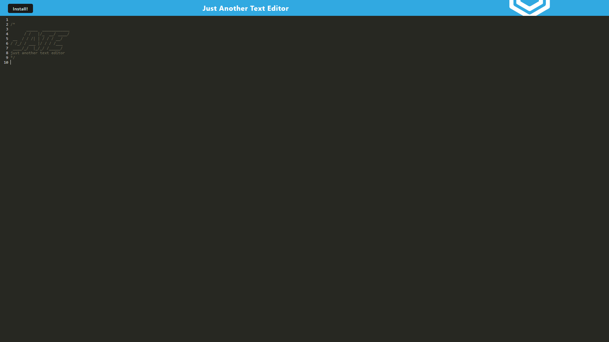

# PWA Project

## Description
This is a Progressive Web Application that is a text editor. It allows you to create, save, and delete notes. It is deployed on Heroku and uses Express.js for the backend.
## Deployed Application
[Click Me!](https://pwa-jate-application-7f9d41171750.herokuapp.com/)
## Screenshot

## Table of Contents
- [Installation](#installation)
- [Usage](#usage)
- [License](#license)
- [Contributing](#contributing)
- [Tests](#tests)
- [Questions](#questions)
## Installation
To install this project, clone the repository and run `npm i` to install the dependencies. Then run `npm run start` to start the server. The application will be running on localhost:3000.
## Usage
This is a text editor that allows you to create text and download the application for offline use.
## License
    This project is licensed under the MIT license.
## Contributing
This is a project for my coding bootcamp, so I will not be accepting contributions.
## Tests
no tests are included in this project.
## Questions
If you have any questions, please contact me at harrisonminer59@gmail.com or visit my GitHub page at https://github.com/DrBubblez.
